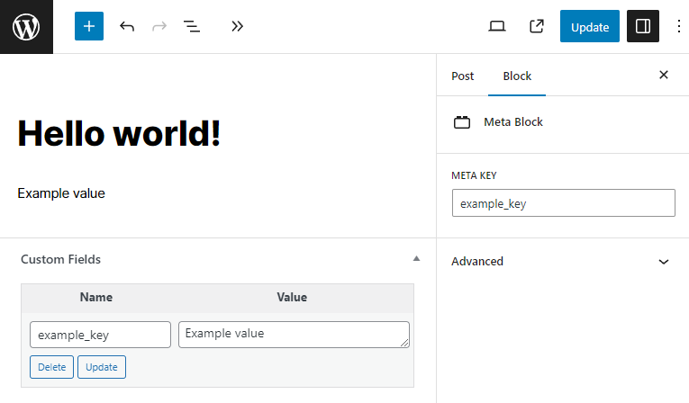

# WordPress Meta Block

This WordPress plugin adds a Meta Block which renders a selected post meta field.

## Screenshot



## Filter

Use `piotrpress/meta_block` filter to change rendered value of the block, e.g.:

```php
add_filter( 'piotrpress/meta_block', fn( $value, $key, $post_id ) => is_array( $value ) ? print_r( $value, true ) : $value, 10, 3 );
```

## Requirements

PHP >= `7.4` version.

## License

[GPL v3 or later](license.txt)